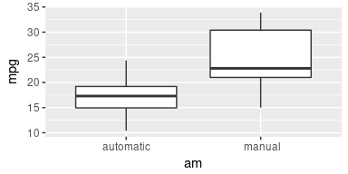
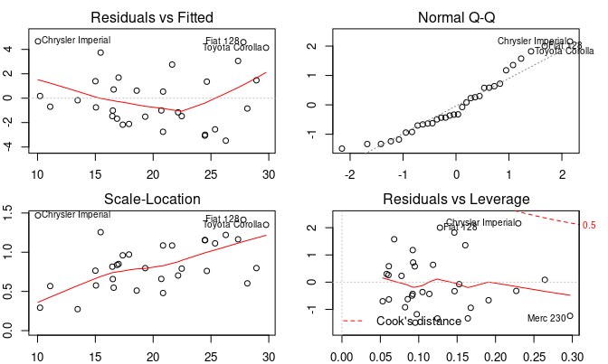
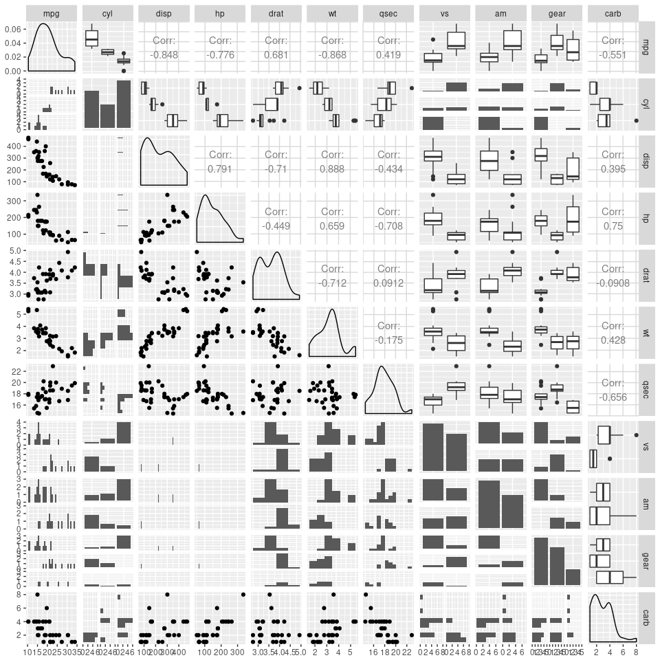

## Overview

In this report we will explore the relationship between a set of variables and miles per gallon (MPG) from a data set of a collection of cars. Specifically, we would like to answer the following two questions:

1. How different is the MPG between automatic and manual transmissions?
2. Is an automatic of manual transmission better for MPG?

Using the dataset `mtcars` we shall embark on a statistical study to address the above two questions.

## Exploratary Data Analysis

We begin the study by conducting some exploratory data analysis. First we load in required libraries:


```r
if (!require("pacman"))
  install.packages("pacman", repos = "http://cran.us.r-project.org")
pacman::p_load(knitr, dplyr, ggplot2, GGally, tidyr, grid, gridExtra, car, broom, tibble)
```

Next we import and examine the dataset (output supressed):


```r
data(mtcars); head(mtcars); str(mtcars)
```

Some of the variables are in the wrong data type and require coercion to the correct data type: 


```r
mtcars$am <- factor(mtcars$am, labels = c('automatic',' manual'))
mtcars$vs <- factor(mtcars$vs, labels = c('V-shaped', 'straight'))
mtcars$cyl <- ordered(mtcars$cyl)
mtcars$gear <- ordered(mtcars$gear)
```


From the boxplot in Figure \ref{fig:box} we can conclude that from the dataset, cars with a manual transmission have a larger median MPG than cars with an automatic transmission. The MPG for cars with a manual transmission also appear to have a larger spread between the first and third quartiles.

In order to visualise the relationship of MPG and transmission type with the other variables we can utilise a pairplot, shown in Figure \ref{fig:pairs}. From the pairplot we can observe that many of the variables are fairly correlated with each other. This suggests that it will be difficult to intepret linear regression results to answer question 2 due to confounding variables.


## Statistical Analysis

### Linear Model with a single variable

If we are only concerned with the bulk effect of transmission type on MPG disregarding other values, we can simply regress `mpg` on `am` and examine the regression coefficients.


```r
fit1 <- lm(mpg ~ am, data=mtcars); tidy(fit1); glance(fit1)
```

```
##          term  estimate std.error statistic      p.value
## 1 (Intercept) 17.147368  1.124603 15.247492 1.133983e-15
## 2   am manual  7.244939  1.764422  4.106127 2.850207e-04
```

```
##   r.squared adj.r.squared    sigma statistic      p.value df    logLik
## 1 0.3597989     0.3384589 4.902029  16.86028 0.0002850207  2 -95.24219
##        AIC      BIC deviance df.residual
## 1 196.4844 200.8816 720.8966          30
```

The coefficient of the linear model with only 1 variable is 7.25, with a p-value of 0.0002, indicating significance and that we should reject the null hypothesis. Therefore is a difference of 7.25 MPG between automatic and manual transmission types, neglecting adjustment for other variables. We note here that the R-squared value for this model is fairly low. This is expected as other variables that can explain the variance in MPG have not been included.

### Linear Model with multiple variables

In this section we fit linear models that include the other variables. First we will try fitting a model with all the variables.


```r
fit2 <- lm(mpg ~ ., data=mtcars)
tidy(fit2)$p.value
```

```
##  [1] 0.35385548 0.53459525 0.13775130 0.48726645 0.08789210 0.71493502
##  [7] 0.07886857 0.32008122 0.33956206 0.16006890 0.72897110 0.49766706
## [13] 0.45676696
```

```r
glance(fit2)
```

```
##   r.squared adj.r.squared    sigma statistic      p.value df    logLik
## 1 0.8845064      0.811563 2.616258  12.12594 1.764049e-06 13 -67.84112
##        AIC      BIC deviance df.residual
## 1 163.6822 184.2025 130.0513          19
```

```r
vif(fit2)
```

```
##           GVIF Df GVIF^(1/(2*Df))
## cyl  44.446614  2        2.582020
## disp 21.894422  1        4.679148
## hp   21.456428  1        4.632108
## drat  5.099622  1        2.258234
## wt   15.800677  1        3.975007
## qsec  8.182966  1        2.860588
## vs    7.423472  1        2.724605
## am    5.910988  1        2.431252
## gear 25.668180  2        2.250861
## carb 12.681439  1        3.561101
```

We can see from the model `fit2` that even though the R-squared and p-value for the model is fairly high and low, at 0.885 and 1.76e-06 respectively, the p-values for each coefficient are all above 0.05. From the data exploration section, we recall that high levels of correlation exists among some of the variables. The generalised variance of inflation (GVIF) values confirm this finding that there is collinearity/multicollinearity present: four of the variables exhibit $GVIF^{\frac{1}{2Df}}$ values larger than $3$. Note that we compare $GVIF^{\frac{1}{2Df}}$ with $\sqrt{VIF}$; the GVIF value is corrected for the degrees of freedom of the variables $Df$, which would be $1$ for numerical and $\geq 1$ for categorical variables. 


To improve upon this model we conduct stepwise regression with the AIC used to judge relative model quality. 


```r
fit3 <- step(fit2, trace=0)
tidy(fit3)
```

```
##          term  estimate std.error statistic      p.value
## 1 (Intercept)  9.617781 6.9595930  1.381946 1.779152e-01
## 2          wt -3.916504 0.7112016 -5.506882 6.952711e-06
## 3        qsec  1.225886 0.2886696  4.246676 2.161737e-04
## 4   am manual  2.935837 1.4109045  2.080819 4.671551e-02
```

```r
glance(fit3)
```

```
##   r.squared adj.r.squared    sigma statistic      p.value df    logLik
## 1 0.8496636     0.8335561 2.458846  52.74964 1.210446e-11  4 -72.05969
##        AIC      BIC deviance df.residual
## 1 154.1194 161.4481 169.2859          28
```

```r
sqrt(vif(fit3))
```

```
##       wt     qsec       am 
## 1.575738 1.168049 1.594189
```

The remaining variables, `wt`, `qsec` and `am` have much lower collinearity and the model coefficients have significant p-values. We can therefore quantify the difference between automatic and manual transmission as 2.94 MPG (standard error of 1.41), with manual transmission having greater fuel economy.

Unfortunately the question of whether manual transmissions are objectively better than automatic transmissions is difficult to answer due to the collinearities present. Even though the other highly correlated variables have been removed from the model, they are still present in reality and it is difficult to conclude which one is causally better for fuel economy. 

## Summary

We have quantified the difference in fuel economy between manual and automatic transmissions. Adjusting for the variables `wt` and `qsec`, manual transmissions present an increase of 2.94 MPG with standard error of 1.41 compared to automatic transmissions. Whether automatic or manual transmissions are better for fuel economy however is more difficult to ascertain due to correlations with other variables. 

\newpage

## Appendix

### A - Boxplot of MPG against transmission type


```r
ggplot(mtcars, aes(x=am,y=mpg)) + geom_boxplot()
```

<div class="figure" style="text-align: center">

<p class="caption">\label{fig:box}Box plot of MPG against transmission type.</p>
</div>

### B - Diagnostic Plot


```r
par(mfrow=c(2,2), mar=c(2,2,2,2)); plot(fit3)
```

<div class="figure" style="text-align: center">

<p class="caption">\label{fig:diag}Plot of residual diagnostics. Residuals appear to follow a gaussian distribution closely.</p>
</div>

\newpage

### C - Pairplot of variables in mtcars dataset


```r
ggpairs(mtcars, lower=list(combo=wrap('facethist',binwidth=0.8)))
```

<div class="figure" style="text-align: center">

<p class="caption">\label{fig:pairs}Pair plot of variables from mtcars dataset.</p>
</div>
